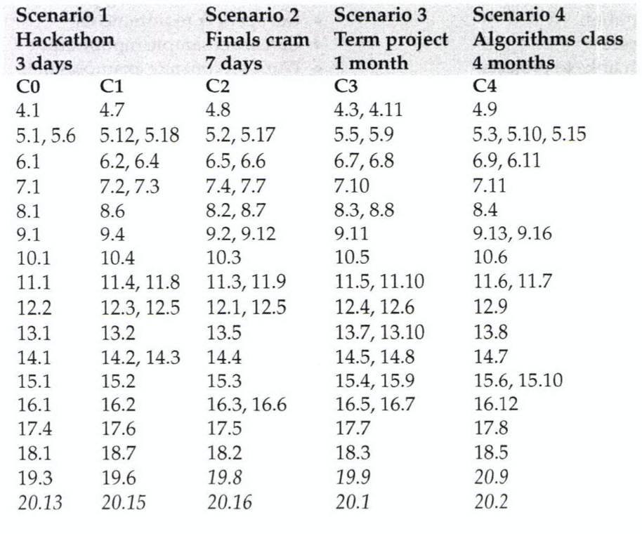

# eopi_solutions
This is a repository jointly held by Arshan Khanifar and Vlad Tkachuk, where we solve the problems of the book 
"Elements of Programming Interviews in Python" 

## Our plan
We first want to start by solving all the problems listed in `Table 1.2` in the book. 
Here is the table for reference:


## How to set up
To clone and make the conda environment:
```
git clone https://github.com/ArshanKhanifar/eopi_solutions
cd eopi_solutions
conda create -y -n eopi_solutions python=3
conda activate eopi_solutions
pip install -r requirements.txt
```

## Jet Brains Setup
Here are some setup if you're working with PyCharm.

### Project Interpreter
First get the path to python executable:
```
$ conda activate eopi_solutions
$ which python
/Users/arshan/opt/miniconda3/envs/eopi_solutions/bin/python
```
* Copy this path
* Go on PyCharm and open this project
* Go to project preferences: (shortcut: `Command + ,`)
* On the left nav bar: `Project(project name)` > `Project Interpreter` 
* `Gear Icon to top right` > `Add` > `Conda Environment` > `Existing Environment`
* Then paste the path you copied above here
* Hit `OK`

### Project Structure
* Go to project preferences: (shortcut: `Command + ,`)
* On the left nav bar: `Project(project name)` > `Project Structure` 
* In the list of files and folders, select `src`
* Mark as: `Sources` (the blue one)
* Hit `OK`

### Running Tests
First, set `pytest` as the default test runner:
* Go to project preferences: (shortcut: `Command + ,`)
* `Tools` > `Python Integrated Tools` > `Testing`: set this to `pytest`
* Hit `OK`
* Open up any test file under `tests/unit_tests` and run it

### Good shortcuts
* `ctrl + shift + r`: run the test the current cursor is on
   * If the cursor is on the test class, the entire class is run.
* `ctrl + r`: run whatever was last run

## Running Tests From Command Line
```
# make sure you're in the project directory
cd ~/eopi_solutions

conda activate eopi_solutions

# This is so that our imports work: all of our source files are under `src`
# but we don't want to import parts of our code like "from src.protocol.* import *"
# rather "from protocol.* import *", by adding src to PYTHONPATH, this will work.
export PYTHONPATH=src:$PYTHONPATH

# run the tests
pytest ./test/unit_tests
```

## Linting and Formatting
```
cd ~/eopi_solutions
export PYTHONPATH=src:$PYTHONPATH
pycodestyle src # if this outputs nothing, you're good
pylint src # this will give you a rating out of 10 (always keep it 10/10)
```
